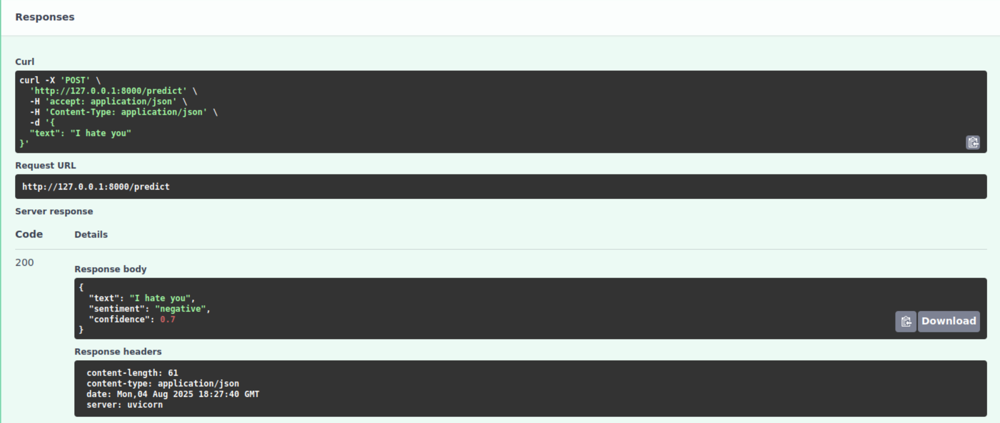

# AI Project with Selective CI/CD

A simple AI project demonstrating how to implement selective CI/CD with Jenkins based on file changes. This project includes:

- **API Service**: FastAPI-based sentiment analysis API
- **Data Pipeline**: Simple data processing and model training pipeline
- **CI/CD**: Jenkins pipeline that only runs for changed components

## Components

### API Service
- Simple sentiment analysis API using FastAPI
- Returns positive/negative sentiment for text input
- Containerized with Docker

### Data Pipeline
- Trains a simple sentiment analysis model
- Processes data and saves model artifacts
- Can be triggered independently

### CI/CD Strategy
The Jenkins pipeline detects changes in specific directories and only runs the relevant CI/CD steps:
- Changes in `api/` → Run API tests, build, and deploy
- Changes in `data-pipeline/` → Run pipeline tests, build, and deploy
- Changes in both → Run both pipelines
- Changes in other files (README, configs) → Run basic validation only

## Quick Start

1. **Local Development**:
   ```bash
   # Start all services
   docker compose up --build

   # API will be available at http://localhost:8000
   # Check API docs at http://localhost:8000/docs
   ```

2. **Test the API**:
   ```bash
   curl -X POST "http://localhost:8000/predict" \
        -H "Content-Type: application/json" \
        -d '{"text": "I love this project!"}'
   ```
   

3. **Run Data Pipeline**:
   ```bash
   cd data-pipeline
   pip install -r requirements.txt
   python train_model.py
   ```

## Jenkins Setup

1. Create a new Jenkins job
2. Use the `jenkins/Jenkinsfile` as the pipeline script
3. Configure webhook to trigger on repository changes
4. The pipeline will automatically detect which components changed and run appropriate CI/CD steps

## Learning Objectives

- Understand modular CI/CD design
- Learn to implement selective pipeline execution
- Practice containerization with Docker
- Experience with FastAPI and simple ML workflows
