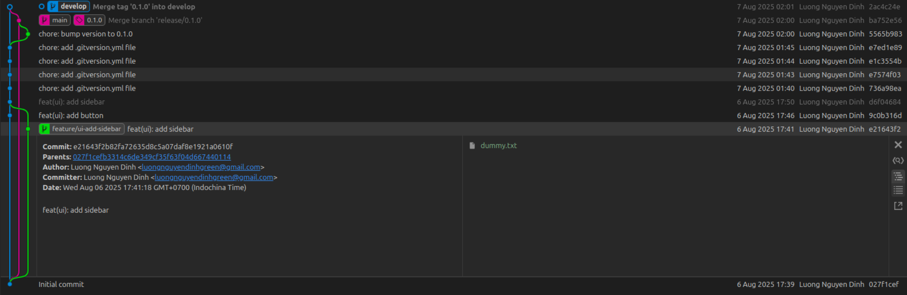
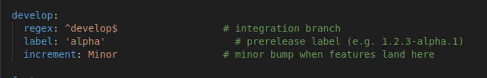

# Gitflow and semantic version

- Setup

    ```bash
    sudo apt-get install git-flow
    ```

- Initialize git and git flow

    ```bash
    git init .
    git flow init
    ```

- Assume that you are developing a brand new UI component, which is a sidebar
    - Initialize new branch for developing new feature. Behind the scene, your friend `git flow` will automatically create a new branch `feature/ui-add-sidebar` and check out to it for you to develop new feature. By default, the new branch is named as `feature/...` and is checked out from develop branch.

        ```bash

        git checkout develop
        git flow feature start ui-add-sidebar
        ```

    - Add new sidebar for your app. In this case, I just append the line `UI - add sidebar` to `dummy.txt` file.

        ```bash
        	echo 'UI - add sidebar' >> dummy.txt
        ```

- Now, you’ve already developed a very cool sidebar, it’s time to commit it

    ```bash
    git add .
    git commit -m "feat(ui): add sidebar"
    ```

    <aside>
    💡

    We follow the Conventional Commits to give each commit a clear, structured name. This helps everyone on the team immediately understand what changed—no more vague messages like `Develop new feature`. Plus, many tools (for example, those that auto-generate your `CHANGELOG.md`) rely on these standardized commit messages to work correctly.

    Reference: [https://www.conventionalcommits.org/en/v1.0.0/#summary](https://www.conventionalcommits.org/en/v1.0.0/#summary)

    </aside>

- Cool! It turns out adding a sidebar makes your application more attractive. Now it’s time to merge into the `develop` branch. In practice, you should open a pull request (PR) so reviewers can provide line-by-line feedback on your new commits. Only merge after you’ve addressed your colleagues’ reviews and updated your code accordingly.

    ```bash
    # For demonstration purposes only. In practice, open a PR instead.

    # Behind the scenes, this performs a fast-forward merge.
    # Resolve any conflicts between your feature branch and develop first, then run:
    git flow feature finish ui-add-sidebar
    ```

    <aside>
    💡

    The best practice is to pull the latest changes from the `develop` branch (and resolve any conflicts) before **pushing a PR** or doing any merging process.

    ```bash
    # 1. Fetch and merge the latest develop into your feature branch
    git pull <remote> develop
    # (Or, to rebase instead of merge)
    # git pull <remote> develop --rebase

    # 2. (Option a) Finish the feature with Git Flow (fast-forward merge)
    git flow feature finish ui-add-sidebar

    # 2. (Option b) Push your feature branch for review (if you skipped Git Flow finish)
    # git push <remote> ui-add-sidebar
    ```

    </aside>

- Currently, you are in `develop` branch. Let’s check the semantic version of this branch using .gitversion

    ```bash
    # Get full json output with semantic version and metadata
    docker run --rm \
      -v "$(pwd)":/repo \
      -w /repo \
      gittools/gitversion:latest \
      /repo /output json
    ```

    ```json
    # Example output
    {
      "AssemblySemFileVer": "0.1.0.0",
      "AssemblySemVer": "0.1.0.0",
      "BranchName": "develop",
      "BuildMetaData": null,
      "CommitDate": "2025-08-06",
      "CommitsSinceVersionSource": 8,
      "EscapedBranchName": "develop",
      "FullBuildMetaData": "Branch.develop.Sha.e7ed1e89283d67c64b245751d579a3c71f03cca0",
      "FullSemVer": "0.1.0-alpha.8",
      "InformationalVersion": "0.1.0-alpha.8+Branch.develop.Sha.e7ed1e89283d67c64b245751d579a3c71f03cca0",
      "Major": 0,
      "MajorMinorPatch": "0.1.0",
      "Minor": 1,
      "Patch": 0,
      "PreReleaseLabel": "alpha",
      "PreReleaseLabelWithDash": "-alpha",
      "PreReleaseNumber": 8,
      "PreReleaseTag": "alpha.8",
      "PreReleaseTagWithDash": "-alpha.8",
      "SemVer": "0.1.0-alpha.8",
      "Sha": "e7ed1e89283d67c64b245751d579a3c71f03cca0",
      "ShortSha": "e7ed1e8",
      "UncommittedChanges": 0,
      "VersionSourceSha": "",
      "WeightedPreReleaseNumber": 8
    }
    ```

    ```bash
    # Get only full semantic version

    docker run --rm \
      -v "$(pwd)":/repo \
      -w /repo \
      gittools/gitversion:latest \
      /repo /showvariable FullSemVer

    # Example output
    # 0.1.0-alpha.8
    ```


- Good to go, now it’s time to release your very first version

    ```bash
    git flow release start 0.1.0
    ```

    - In this stage, we typically do the following steps:
        - Bump version numbers in `package.json`, docs, etc.
        - Update CHANGELOG
        - Run final tests, QA
- After that, you can commit the changes

    ```bash
    git add .

    git commit -m "chore: bump version to 0.1.0"
    ```

- Finish the release stage. Behind the scene, your friend `git flow` automatically merge to branch main and tag the version.

    ```bash
    git flow release finish 0.1.0
    ```

    **Example git graph**

    

- Let’s check again the semantic version

    ```bash
    # Checkout branch develop
    git checkout develop

    # Get only full semantic version
    docker run --rm \
      -v "$(pwd)":/repo \
      -w /repo \
      gittools/gitversion:latest \
      /repo /showvariable FullSemVer

    # Example output:
    # 0.2.0-alpha.1
    ```

    Why is the result **0.2.0-alpha.1**?

    - As configured in `.gitversion.yml`, every time new commits are merged into the `develop` branch, GitVersion detects a **minor** change. Since the previous version was `0.1.0`, it bumps to `0.2.0` and appends the prerelease tag, yielding `0.2.0-alpha.1`.

        


    ```bash
    # Checkout branch main
    git checkout main

    # Get only full semantic version
    docker run --rm \
      -v "$(pwd)":/repo \
      -w /repo \
      gittools/gitversion:latest \
      /repo /showvariable FullSemVer

    # Example output:
    # 0.1.0
    ```

    Why 0.1.0 ???

    - **Use your last tagged release**

        By default, GitVersion looks for the highest version tag on `main` (e.g. `0.1.0`) and bases its calculation on that.

    - **Not append a prerelease suffix**

        Unlike `develop` (which you’ve configured to produce a prerelease on every merge), `main` is configured for *stable* releases, so it emits the exact tag.

    - **Skip any bump if there are no new commits**

        Since you haven’t merged any hotfixes or made direct commits on `main` after tagging `0.1.0`, there’s nothing to increment.
